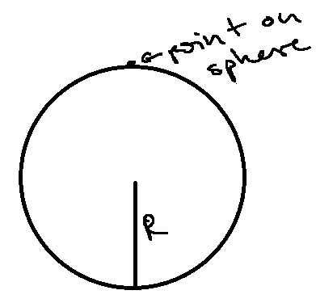
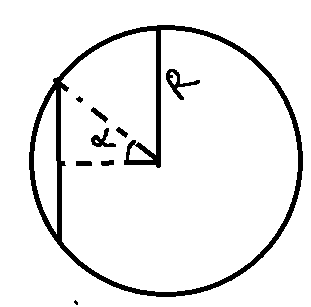
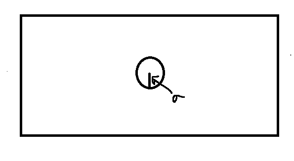
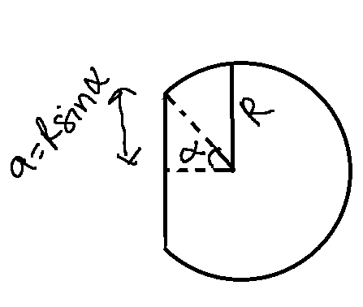

General Intro to `beamshapes`
=============================
Sound sources don't radiate sound uniformly most of the time. Even us humans for instance, we emit more energy while talking to the front than to the back. The exact (non-uniform) pattern in which sound is radiated defines the 'beamshape' of a source. The beamshape is typically a combination of the frequency of emitted sound and the geometry of the vibrating surface and its associated (non-vibrating) surfaces. 

Let's go through the main concepts required to use the `beamshapes` package.

Input Parameters
----------------
The inputs will tend to be model-specific, but the common input parameters
to keep in mind are:

    #. `k`, wavenumber. This is :math:`\frac{2\pi}{\lambda}`
    #. :math:`\lambda`, wavelength or :math:`\frac{v_\text{sound}}{\text{frequency}}`
    #. `a` : piston radius, wherever applicable
    #. `R` : sphere radius, wherever applicable. 
    #. :math:`\alpha, \theta, \phi`: various angles describing the size of the oscillating portion. These angles are in radians - not degrees!

The values of these input parameters are stored in a dictionary.
Remember to try and use :code:`mpmath` objects (eg. :code:`mpmath.pi`, or :code:`mpmath.mpf`)
to set the input parameter values if you're interested in getting  high-precision output.      
This means, eg. using :code:`mpmath.pi/3` instead of :code:`np.pi/3`, or :code:`math.pi/3`.

Source models
-------------
A 'beamshape' is tightly bound to the input parameters, and the sound source model behind
it eg. piston in a sphere, cap of a sphere etc. The source model refers to the source
of sound and its geometric properties, and assumptions of the vibrations etc. According
to the situation in hand, different source models may be physically/biologically relevant! 

`Point on a sphere schematic`

	
`Oscillating cap of a sphere schematic`

	

`Piston in an infinite baffle schematic`

`Piston in a sphere schematic`

Directionality functions
------------------------
Each source model has an associated `directionality` function with it. 
The directionality function returns the :math:`20log_{10}(D_{\theta}/D_{0})`
value for a given set of angles. Some models require a long time to compute 
coefficients, and also output other objects to save time for future runs.

The oscillating cap in a sphere does not produce additional output

.. code-block:: shell

    # .... having chosen certain input parameters and put them into  input_params
    >>> import mpmath
    >>> import beamshapes as beamshapes
    >>> from beamshapes import cap_in_sphere_directionality
    >>> angles = mpmath.linspace(0,pi,10) 
    >>>  _, spherecap_beam = cap_in_sphere_directionality(angles, input_params)

In case the chosen source model's directionality requires intensive calculations
to generate estimates, then the calculated outputs are also returned. 

.. code-block:: shell
    
    # .... having chosen certain input parameters and put them into input_params 
    >>> import mpmath
    >>> import beamshapes as beamshapes
    >>> from beamshapes import piston_in_sphere_directionality
    >>> angles = mpmath.linspace(0,pi,10) 
    >>> An_out, spherepiston_beam = piston_in_sphere_directionality(angles, input_params)
    # in case of wanting to calculate more points now - it saves time to do this:
    >>> input_params['An'] = An_out
    >>> new_angles = mpmath.linspace(0,pi,100)
    >>> _, detailed_spherepiston_beam = piston_in_sphere_directionality(new_angles, input_params)

