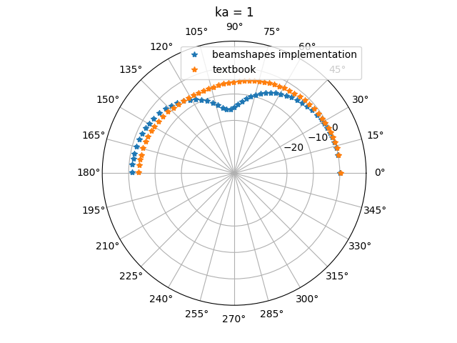
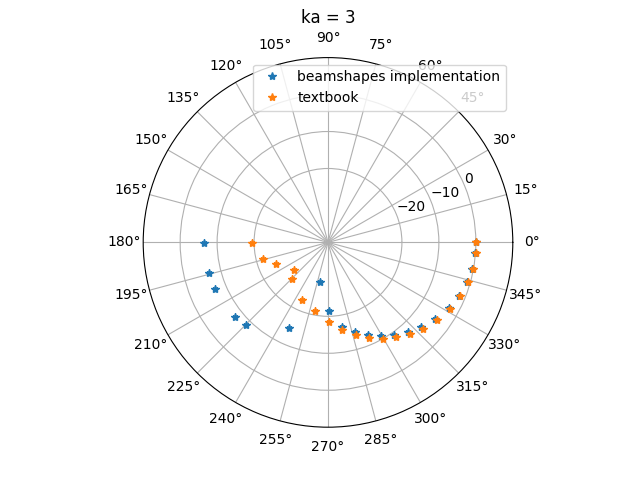

Notes for Piston in a Sphere (Beranek & Mellow 2012)
====================================================

updated 2021-05-30

The previous post on this page highlighted what seemed to be two discrepancies (check commit 46c11ec..), the first being a potential typo in equation 12.98, which described
:math:`\frac{\partial}{\partial \theta} P_n(cos \theta)` . Upon closer inspection I realised there was no typo, and it was an interpretational error on my part. 

However, discrepancy 2) related to a difference in `m` and `n` index order between the equations in the book and the Mathematica code implementation.
This post dives into more detail. 

The `m` and `n` index order discrepancy
~~~~~~~~~~~~~~~~~~~~~~~~~~~~~~~~~~~~~~~

I. Expectations from substitutions
^^^^^^^^^^^^^^^^^^^^^^^^^^^^^^^^^^

The solution for :math:`K_{mn}` (eqn. 12.107) is given in App.II, eqn. 70. In the case where  :math:`m \neq n`, the solution is:

.. math:: 

    \frac{sin\:\alpha( P_{m}(cos\:\alpha)P^{\prime}_{n}(cos\:\alpha) - P_{n}(cos\:\alpha)P^{\prime}_{m}(cos\:\alpha))}{m(m+1) - n(n+1)}

Which we'll visually re-arrange for better comparison after substitution:

.. math::

    \frac{sin\:\alpha}{m(m+1) - n(n+1)}\bigg( P_{m}(cos\:\alpha)P^{\prime}_{n}(cos\:\alpha) - P_{n}(cos\:\alpha)P^{\prime}_{m}(cos\:\alpha) \bigg)

Where :math:`P^{\prime}_{n}(cos \theta)` (eqn. 12.98) is:

.. math::

    P^{\prime}_{n}(cos \theta) = \frac{\partial}{\partial \theta}P_{n}(cos \theta) = - \frac{n(n+1)}{(2n+1)sin \theta}(P_{n-1}(cos \theta) - P_{n+1}(cos \theta))
    
    = \frac{n(n+1)}{(2n+1)sin \theta}(P_{n+1}(cos \theta) - P_{n-1}(cos \theta))

When we do the substitutions for :math:`P^{\prime}_{n}(cos\:\alpha)`, :math:`P^{\prime}_{m}(cos\:\alpha)` in App.II,eqn.70 and :math:`\theta = \alpha`,
the full term is expected to be:

.. math::

    \frac{sin\:\alpha}{m(m+1) - n(n+1)} \\
    \left( P_{m}(cos\:\alpha)\frac{n(n+1)}{(2n+1)sin\:\alpha}(P_{n+1}(cos\:\alpha) - P_{n-1}(cos\:\alpha)) \\
     - P_{n}(cos\:\alpha)\frac{m(m+1)}{(2m+1)sin\:\alpha}(P_{m+1}(cos\:\alpha) - P_{m-1}(cos\:\alpha)) \right)

As of now the :code:`beamshapes`  piston in a sphere implementation follows the above equation. 
    
II. The `Mathematica` code implementation
^^^^^^^^^^^^^^^^^^^^^^^^^^^^^^^^^^^^^^^^^

The original `Mathematica` implementation used to generate Fig. 12.23 has the equivalent of:

.. math::

    \frac{sin\:\alpha}{m(m+1) - n(n+1)} \\
    \left( P_{n}(cos\:\alpha)\frac{m(m+1)}{(2m+1)(sin\:\alpha)}(P_{m+1}(cos\:\alpha)-P_{m-1}(cos\:\alpha)) \\
     - P_{m}(cos\:\alpha)\frac{n(n+1)}{(2n+1)(sin\:\alpha)}(P_{n+1}(cos\:\alpha)-P_{n-1}(cos\:\alpha)) \right)

The `m` and `n` indices have been switched in the :math:`P_{m/n}(cos\:\alpha)` and the :math:`P^{\prime}_{m/n}(cos\:\alpha)` terms -- but the 
:math:`m(m+1) - n(n+1)` denominator term remains the same order as in section `I` .

III. Comparing directivity patterns from sections I and II
^^^^^^^^^^^^^^^^^^^^^^^^^^^^^^^^^^^^^^^^^^^^^^^^^^^^^^^^^^

The switch in `m` and `n` indices between II and III for leads to different  directivity patterns - here `ka=1` and `ka=3` is shown. 
 

The confusion to be cleared up is whether App.II eqn. 70 (section `I`) or the coded implementation (section `II`) is the correct solution for :math:`K_{mn}` when :math:`m \neq n`.

Is the current `beamshapes` implementation the result of a coding error? No, as switching the `m,n` indices for the :math:`P_{m/n}` and :math:`P^{\prime}_{m/n}` terms
recreates Fig. 12.23 (not shown here). 

Acknowledgements
~~~~~~~~~~~~~~~~
Thanks to Gaurav Dhariwal for re-checking the math once more. 

References
~~~~~~~~~~
* Chp 12, Beranek, L. L., & Mellow, T. (2012). Acoustics: sound fields and transducers. Academic Press.
* To see code implementations check out the :code:`piston_in_sphere` documentation